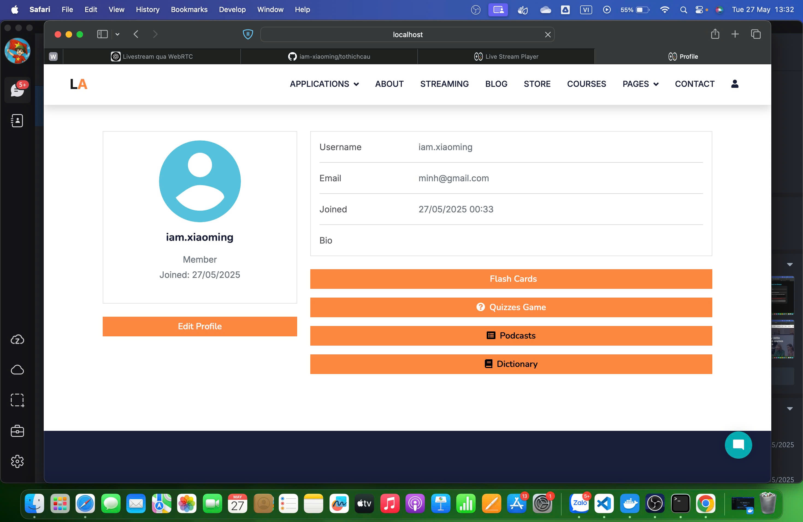
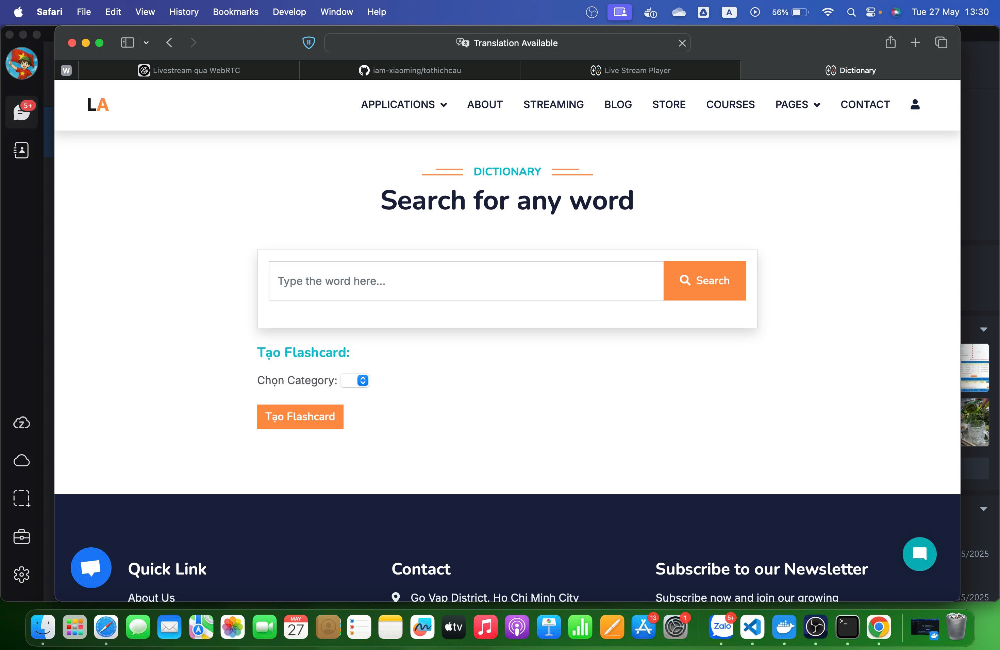
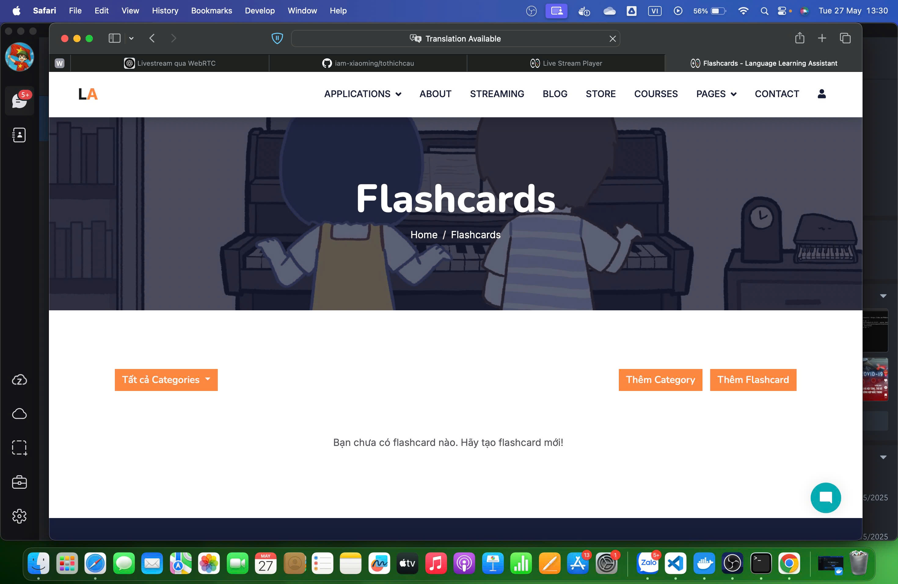
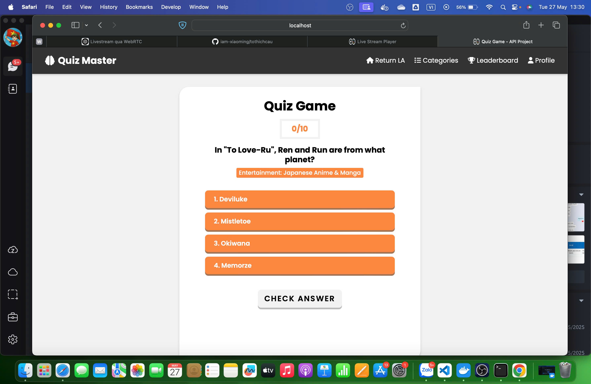
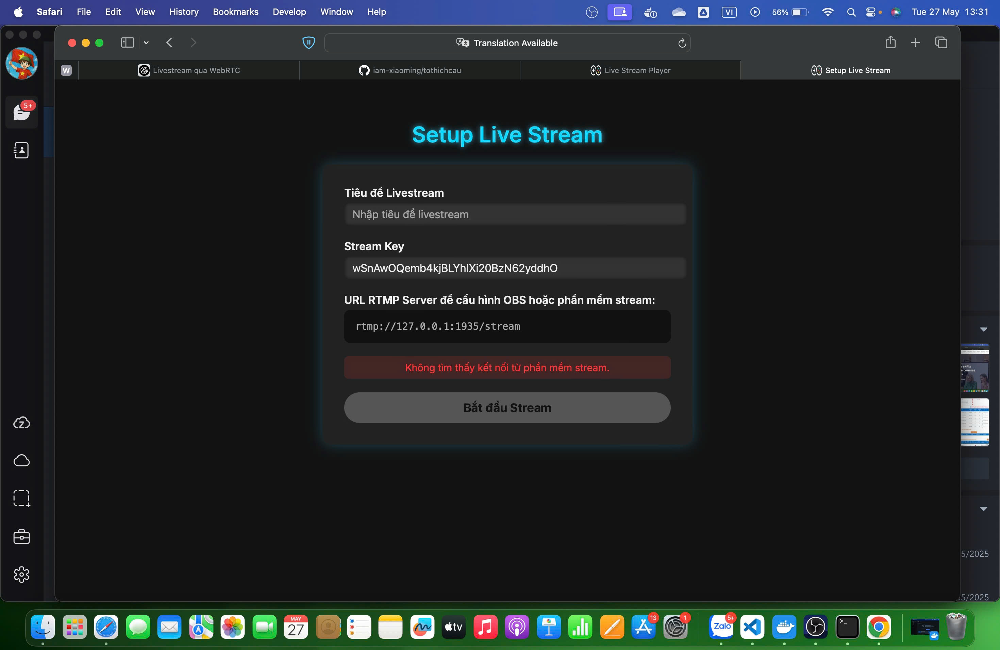
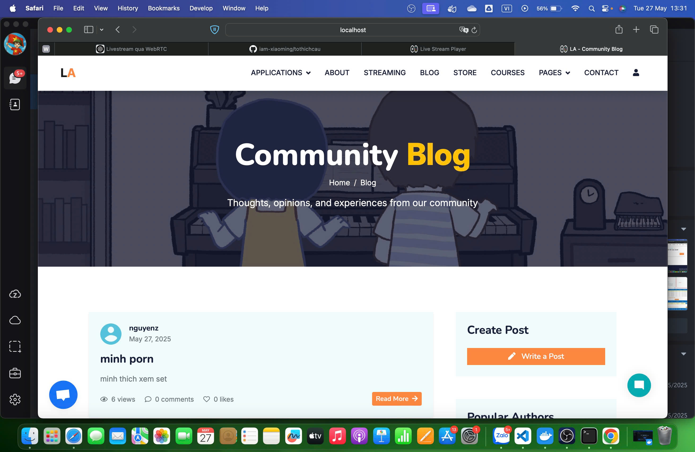
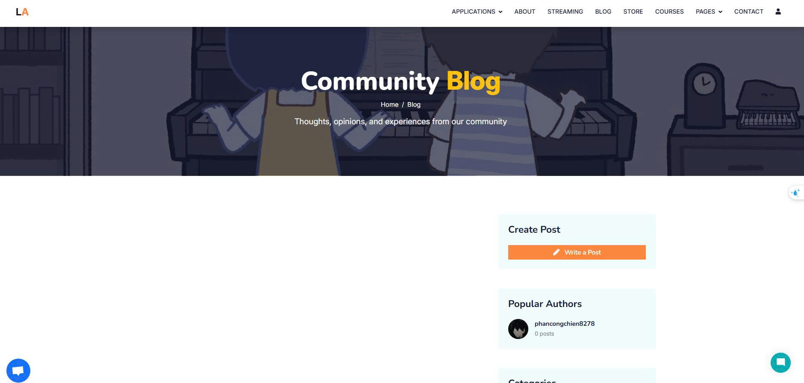
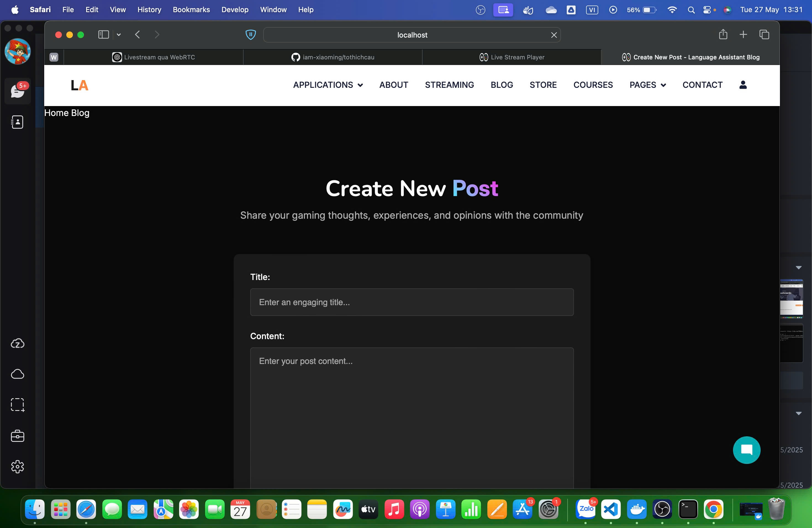
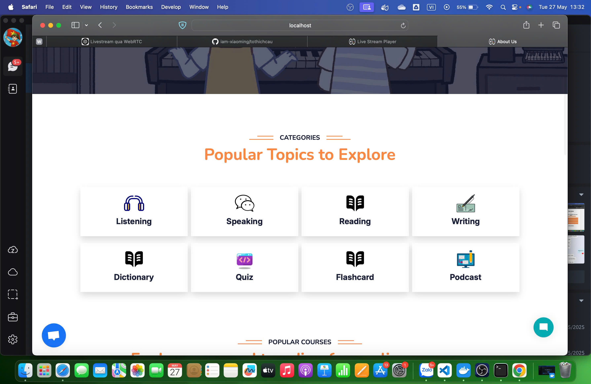

# 🌏 LANGUAGE ASSISTANT - TRỢ LÝ NGÔN NGỮ

- Trang chủ 

## 📝 Giới thiệu

Language Assistant là nền tảng hỗ trợ học và sử dụng ngoại ngữ thông minh, được thiết kế để giúp người dùng vượt qua rào cản ngôn ngữ trong học tập, công việc và cuộc sống hàng ngày.

Xuất phát từ triết lý: "Mỗi người đều xứng đáng có một trợ lý ngôn ngữ riêng", chúng tôi mang đến công cụ đa năng, thông minh và trực quan cho người học ở mọi trình độ.

## ✨ Tính năng chính

- **🔤 Dịch thuật thông minh**: Hỗ trợ dịch đa ngôn ngữ với văn phong tự nhiên, bám sát ngữ cảnh và cung cấp ví dụ minh họa
- **💬 Hội thoại tương tác**: Mô phỏng giao tiếp thực tế để rèn luyện phản xạ ngôn ngữ
- **📚 Tích hợp từ điển**: Hỗ trợ tra cứu từ ngữ nhanh chóng và dễ dàng
- **📈 Bộ câu hỏi giải trí**: Sở hữu bộ câu hỏi bằng tiếng anh để giải trí và thêm vốn từ vựng

## 🛠️ Công nghệ và ứng dụng đã sử dụng

### Công nghệ chính
- **Python**: Ngôn ngữ lập trình chính để phát triển backend.
- **HTML/CSS/JavaScript**: Xây dựng giao diện người dùng.
- **Bootstrap**: Framework CSS để thiết kế giao diện responsive.
- **SQLite**: Cơ sở dữ liệu mặc định cho phát triển và thử nghiệm.
- **Docker**: Đóng gói và triển khai ứng dụng dễ dàng.

### Ứng dụng hỗ trợ
- **Git**: Quản lý mã nguồn và cộng tác nhóm.
- **Visual Studio Code**: IDE chính để phát triển.
- **Gemini API**: Tích hợp trí tuệ nhân tạo của Google.
- **Free Dictionary API**: Hỗ trợ tra cứu từ điển
- **Opentdb API**: Kho lưu trữ câu hỏi miễn phí

### Ứng dụng được DEPLOY tại RENDER : [ https://language-assistant.onrender.com/](https://language-assistant.onrender.com)

### Lý do lựa chọn
Các công nghệ và ứng dụng trên được lựa chọn để đảm bảo hiệu suất, tính linh hoạt và khả năng mở rộng của dự án, đồng thời hỗ trợ nhóm phát triển làm việc hiệu quả và nhanh chóng.


## 🛠️ Hướng dẫn cài đặt

### Yêu cầu hệ thống
- Python 3.8 trở lên
- Git
- Pip (Python Package Installer)

### 1. Cài đặt Git (nếu chưa có)

**Windows:**
- Tải Git tại: [https://git-scm.com/download/win](https://git-scm.com/download/win)
- Chạy file `.exe` và làm theo hướng dẫn cài đặt

**Ubuntu/Debian:**
```bash
sudo apt update
sudo apt install git
```

**macOS:**
```bash
brew install git
```

### 2. Clone repository

```bash
# Sử dụng HTTPS
git clone https://github.com/iuh-application-development/Language-Learning-Assistant-2.git

# Hoặc sử dụng SSH (cần cấu hình SSH key)
git clone git@github.com:iuh-application-development/Language-Learning-Assistant-2.git

# Di chuyển vào thư mục dự án
cd Language-Learning-Assistant-2
```

### 3. Cài đặt môi trường ảo và các phụ thuộc

**Windows:**
```bash
# Tạo môi trường ảo
python -m venv venv

# Kích hoạt môi trường ảo
venv\Scripts\activate

# Cài đặt các gói phụ thuộc
pip install -r requirements.txt
```

**Linux/macOS:**
```bash
# Tạo môi trường ảo
python3 -m venv venv

# Kích hoạt môi trường ảo
source venv/bin/activate

# Cài đặt các gói phụ thuộc
pip install -r requirements.txt
```

### 4. Khởi động nhanh

Để cài đặt và chạy ứng dụng nhanh chóng, bạn có thể sử dụng script tự động:

**Windows:**
```bash
# Chạy file cài đặt tự động
install.bat
```

**Linux/macOS:**
```bash
# Cấp quyền thực thi cho script
chmod +x install.sh

# Chạy script cài đặt
./install.sh
```

# Hướng dẫn build docker image
 Nhập lệnh 
 ```
 docker build -t LanAssist .
 ```

## 🚀 Hướng dẫn sử dụng Django

### Chạy Server Django

Di chuyển vào thư mục language_assistant
```bash
cd language_assistant
```
Khởi động server

```bash
python manage.py runserver
```
- Server phát triển sẽ chạy tại địa chỉ mặc định: `http://127.0.0.1:8000/`
- Để dừng server, nhấn `Ctrl + C`

### Truy cập trang admin(cần tạo superuser trước)

- Trang admin sẽ chạy tại địa chỉ mặc định: `http://127.0.0.1:8000/admin`

### Quản lý Database (Migrations)

```bash
# Tạo file migration khi thay đổi models
python manage.py makemigrations

# Áp dụng migrations vào database
python manage.py migrate
```

### Tạo tài khoản quản trị viên

```bash
python manage.py createsuperuser
```
- Làm theo hướng dẫn để nhập thông tin tài khoản
- Sử dụng tài khoản này để đăng nhập tại đường dẫn `/admin`

### Công cụ phát triển và thử nghiệm

```bash
# Mở Django shell để thử nghiệm code và truy vấn dữ liệu
python manage.py shell

# Kiểm tra phiên bản Django đang sử dụng
python -m django --version
```

#### Link dự án đã hoàn thành:
[Language-Learning-Assistant-2](https://language-assistant.onrender.com/login/)

#### Link github dự án đã deploy: 
[link](https://github.com/PlusNguyn/Language-Assistant.git)

## 🔍 Cấu trúc dự án

Tham khảo structure.txt


## 🤝 Đóng góp

Chúng tôi luôn chào đón mọi đóng góp từ cộng đồng! Nếu bạn muốn tham gia phát triển dự án:

1. Fork repository này
2. Tạo nhánh tính năng (`git checkout -b feature/amazing-feature`)
3. Commit thay đổi của bạn (`git commit -m 'Add some amazing feature'`)
4. Push lên nhánh đã tạo (`git push origin feature/amazing-feature`)
5. Mở Pull Request

## 📞 Liên hệ và hỗ trợ

- **Email: minhnguyen47431@gmail.com**
- **Website: https://www.facebook.com/profile.php?id=100027733654960&mibextid=LQQJ4d** 
---


## 👥 Đội ngũ phát triển

| Họ và tên | Mã số sinh viên | Vai trò | Email | GitHub |
|-----------|----------------|---------|-------|--------|
| Nguyễn Ngọc Minh | 22685841 | Team Leader | minhnguyen47431@gmail.com | [Link](https://github.com/xiaoMing-04) |
| Trần Thái Nguyên | 22697051 | Frontend Developer | tnguyenz2520@gmail.com | [Link](https://github.com/PlusNguyn) |
| Phan Công Chiến | 22685651 | Backend Developer | phancongchien8278@gmail.com |  [Link](https://github.com/chien24)|
| Trần Khắc Liêm | 22685251 | UI/UX Designer | liemem147852@gmail.com | [Link](https://github.com/T-K-Liem275) |


---

## 🔧 Phân công công việc

| Họ và tên            | Công việc phụ trách                                                                                                                                                                                                                                     |
| -------------------- | ------------------------------------------------------------------------------------------------------------------------------------------------------------------------------------------------------------------------------------------------------- |
| **Trần Thái Nguyên** | - Cấu hình cơ sở dữ liệu Aiven (PostgreSQL) <br> - Từ điển (tra cứu, lưu trữ từ vựng) <br>  - Viết giao diện (Frontend) - Viết Dockerfile cho ứng dụng <br>  - Triển khai ứng dụng trên Render <br>                                                                                                         |
| **Phan Công Chiến**  | - Tính năng flashcard (học từ vựng bằng thẻ) <br> - Chức năng đăng nhập/đăng ký <br>  - Tích hợp Firebase (xác thực hoặc lưu trữ nếu có)                                                                             |
| **Nguyễn Ngọc Minh** | - Chức năng đăng nhập/đăng ký <br> - Tính năng chatbot (trò chuyện học tập) <br> - Giao diện người dùng (Frontend) <br> - Tích hợp Cripschat (live chat hỗ trợ) <br>  - Viết blog (giới thiệu, hướng dẫn sử dụng) |
| **Trần Khắc Liêm**   | - Tính năng làm quiz (trắc nghiệm từ vựng) <br> - Giao diện người dùng (Frontend) <br> - Viết unit test <br> - Viết blog (giới thiệu, hướng dẫn sử dụng)                                                                               |

---
## Kết quả đạt được 
- Profile 
- Từ điển 
- Flashcard 
- Quizgame 
- Livestream 
- Blog 
- Tạo blog 
- Viết blog 
- Khóa học 
---
## Kết quả chưa đạt được

---

## 🌐 Xu hướng phát triển Web Trợ Lý Ngôn Ngữ (Language Assistant Web App)

**Web trợ lý ngôn ngữ** đang và sẽ tiếp tục phát triển mạnh mẽ nhờ sự kết hợp giữa **trí tuệ nhân tạo (AI)**, **xử lý ngôn ngữ tự nhiên (NLP)** và các **công nghệ web hiện đại**. 
- Dưới đây là những hướng đi tiêu biểu và tiềm năng trong tương lai:

---

### 1. 🎯 Tùy biến theo ngữ cảnh và cá nhân hóa

* **Tự học hành vi người dùng**: Ghi nhớ thói quen, sở thích và phong cách viết riêng của từng cá nhân.
* **Tùy chỉnh đầu ra theo mục đích**: Gợi ý giọng văn phù hợp cho các tình huống như viết email chuyên nghiệp, mô tả sản phẩm thu hút, dịch thuật mang tính bản địa hóa cao.

---

### 2. 🌍 Hỗ trợ đa ngôn ngữ và dịch thuật thông minh

* **Dịch ngữ cảnh nâng cao** (context-aware): Hiểu được ý nghĩa sâu và sắc thái của ngôn ngữ.
* **Chuyển ngữ đồng thời** (real-time translation): Hữu ích trong học tập, hội họp, và giao tiếp xuyên biên giới.

---

### 3. 🖼️ Tích hợp đa phương tiện

* **Speech-to-Text & Text-to-Speech**: Nhận diện và phản hồi bằng giọng nói tự nhiên.
* **Hỗ trợ hình ảnh, biểu đồ, video**: Trình bày nội dung sinh động và dễ hiểu hơn – ví dụ như minh họa bằng sơ đồ tư duy hoặc video hướng dẫn.

---

### 4. 🔗 Kết nối với hệ thống và nền tảng khác

* **Tích hợp hệ thống doanh nghiệp**: CRM, hệ thống hỗ trợ khách hàng, quản lý tài liệu nội bộ.
* **Plugin và tiện ích mở rộng**: Dành cho Google Docs, Notion, WordPress, Figma, v.v.

---

### 5. 🤖 AI nâng cao và tư duy nhiều bước

* **Tác vụ phức tạp hơn**: Như lập kế hoạch, viết báo cáo, phân tích thị trường, hoặc hỗ trợ nghiên cứu học thuật/pháp lý.
* **Reasoning nhiều bước**: Có khả năng thực hiện chuỗi nhiệm vụ thay vì phản hồi đơn lẻ.

---

### 6. 🔐 Bảo mật và đạo đức AI

* **Tăng cường bảo vệ dữ liệu cá nhân**.
* **Minh bạch về quy trình xử lý thông tin**.
* **AI đạo đức**: Kiểm soát định kiến, lọc nội dung nhạy cảm, đảm bảo sử dụng đúng mục đích.

---

### 7. 🧠 Tương tác tự nhiên và liên tục

* **Kết hợp đa hình thức giao tiếp**: Văn bản, giọng nói, hình ảnh, cử chỉ.
* **Giao tiếp liền mạch**: Trợ lý có khả năng ghi nhớ và duy trì mạch hội thoại dựa trên lịch sử tương tác.

---
© 2025 Language Assistant Team. All rights reserved
